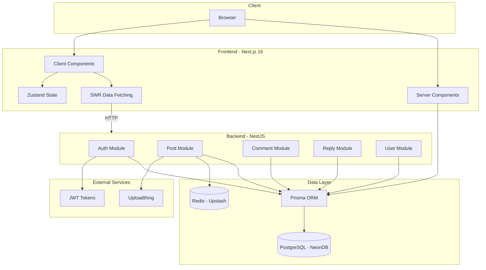
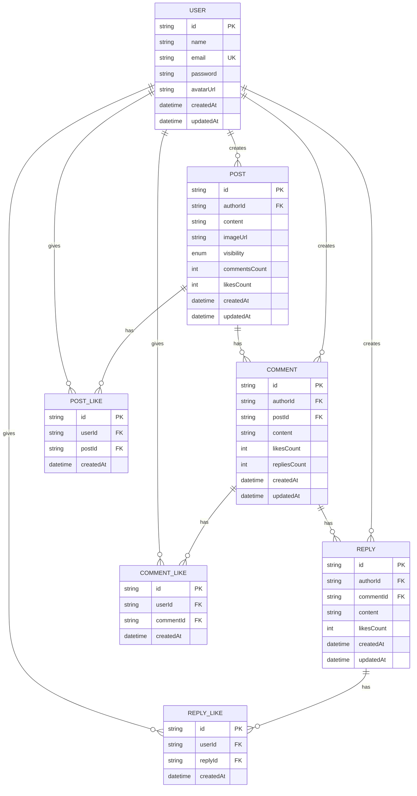
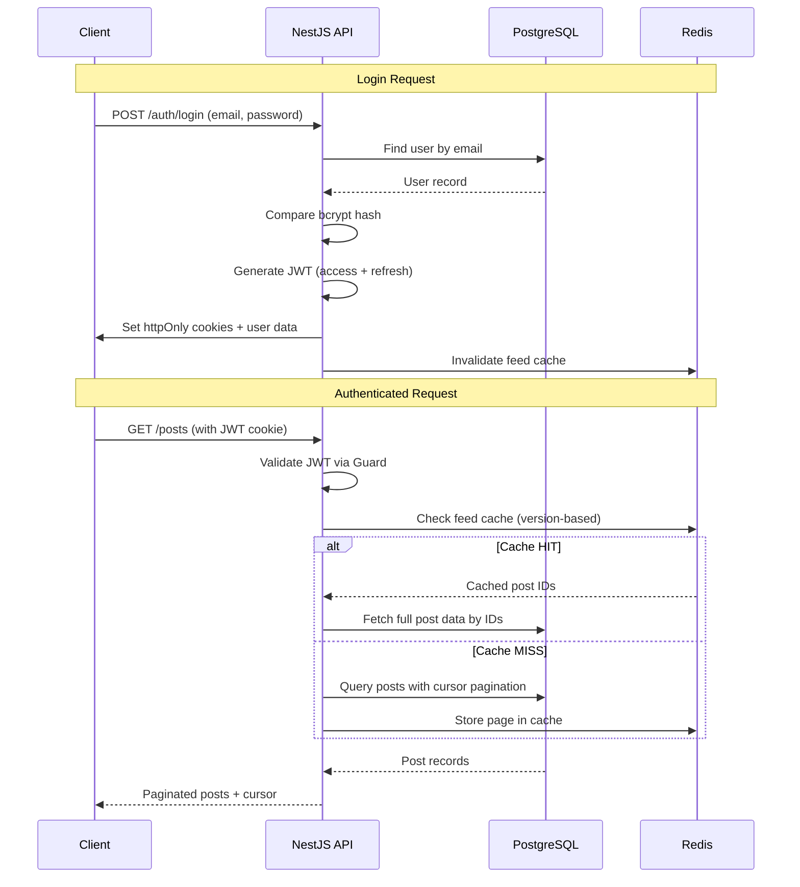
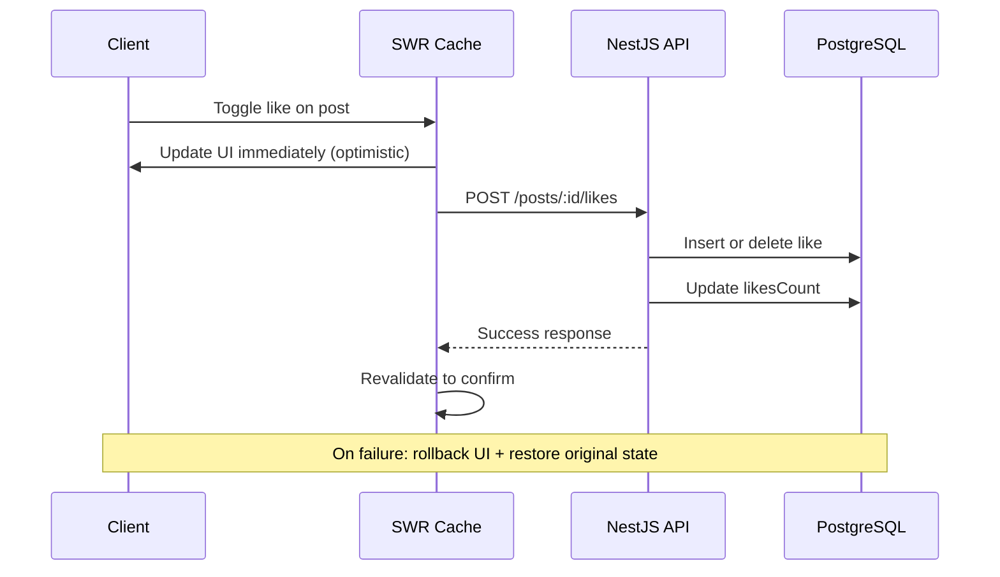

<p align="center">
  
</p>

<h1 align="center">Buddy Script</h1>

<p align="center">A full-stack social media platform built with Next.js and NestJS, designed from the ground up to handle millions of posts and reads. Think of it as a simplified version of social media feed where users can create posts, interact with each other through comments and likes, and control who sees their content.</p>

## System Architecture



## Database Schema



## Request Flow

### Authentication Flow



### Optimistic Update Flow



## What It Does

### Authentication & Registration

Users sign up with their name, email, and a password that actually has to be strong. The system uses JWT tokens stored in httpOnly cookies, so there's no XSS risk from token theft. Refresh tokens rotate automatically, and passwords are hashed with bcrypt.

The backend normalizes emails to lowercase on signup and login. Rate limiting is baked in too, registration is capped at 5 attempts per minute, login at 10, and token refresh at 20. This prevents brute force attacks without getting in the way of normal usage.

### The Feed

The main feed shows all public posts from every user, sorted newest first. It uses cursor based pagination instead of offset based. This means scrolling through hundreds of posts stays fast because the database doesn't have to skip rows. Each page loads 20 posts by default, and you can load more by just scrolling to the bottom as it uses intersection observer.

Posts support both text and images. When you upload an image, it is stored in `Uploadthing` and displayed inline. The feed is cached aggressively using `Redis` `(Upstash)`, with a version based invalidation strategy. When someone creates a new post, the feed version bumps and all cached pages get invalidated. This keeps the cache fresh without constant database queries.

### Posts

Creating a post is straightforward, type your message, optionally attach an image, choose whether it's public or private, and hit Enter. Private posts only show up in your own feed; nobody else can see them. The UI uses optimistic updates, so your post appears instantly in the feed while the server processes it in the background.

Posts show who liked them (with avatar previews), how many comments they have, and how long ago they were created. You can like and unlike posts with a single click. The count updates immediately without waiting for the server.

### Comments

Every post has a comment section that expands when you click "Comment." Comments support the same optimistic pattern as posts type your comment, press Enter, and it appears right away. The comment count on the post updates in real-time.

Comments display the author's name, their avatar, a like button, and a timestamp. You can like and unlike comments the same way you like posts.

### Replies

Comments can have threaded replies. When you click "Reply" on a comment, a reply composer opens with your avatar and a text area. Replies are nested under their parent comment with a subtle left border to show the hierarchy. The reply count updates live, and you can expand to see more replies if there are many.

Like everything else, replies use optimistic updates - they appear instantly while the API call happens in the background. If something goes wrong, the reply disappears and your text is restored so you can try again.

### Likes

Likes work everywhere posts, comments, and replies. The system tracks exactly who liked what, and shows up to 5 avatar previews on posts. Hovering over the like count reveals a tooltip with the full list of people who liked it. The like state is per-user, so you can see whether you've liked something and toggle it.

## The Tech Stack

### Frontend (Next.js)

- **Next.js 15** with App Router - server components where possible, client components for interactivity
- **SWR** for data fetching with infinite scroll pagination
- **Zustand** for client-side state (current user)
- **Custom CSS** for styling
- **dayjs** for relative timestamps ("2 hours ago")
- **Zod** for runtime type validation on all API responses

The frontend uses server actions for API calls, which keeps the server/client boundary clean. All responses are validated against Zod schemas before being used, so type errors get caught at runtime too.

### Backend (NestJS)

- **NestJS** with a modular architecture (Auth, User, Post, Comment, Reply modules)
- **Prisma** as the ORM with PostgreSQL
- **JWT** authentication with access + refresh token rotation
- **bcrypt** for password hashing (10 salt rounds)
- **Redis (Upstash)** for caching feed pages, post summaries, and like lists
- **Uploadthing** for image uploads
- **Swagger** API documentation at `/documentation`

### Database Design

The database is designed for performance at scale. Key design decisions:

- **Composite indexes** - on every query pattern posts are indexed by `(visibility, createdAt DESC, id DESC)` so the feed query is a single index scan
- **Denormalized counters** - `commentsCount` and `likesCount` are stored directly on posts and comments instead of being calculated with COUNT queries
- **Cursor-based pagination** - every list endpoint uses cursor pagination instead of OFFSET/LIMIT, which stays fast regardless of how many rows exist
- **Unique constraints** on like tables prevent duplicate likes at the database level

The schema covers Users, Posts, Comments, Replies, and Like tables for each entity. Cascade deletes ensure data stays consistent deleting a post removes all its comments, replies, and likes.

### Security

- **httpOnly cookies** for JWT tokens JavaScript can't access them, preventing XSS attacks
- **CORS** configured to only allow requests from the frontend origin
- **Rate limiting** on all auth endpoints
- **Email normalization** prevents account duplication through case differences
- **Strong password requirements** enforced at both the schema and validation layers
- **CSRF protection** through SameSite cookie attributes

### Performance

- **Redis caching** for the feed, post summaries, and like lists with TTL-based expiration
- **Feed version invalidation** - instead of caching individual queries, we cache entire pages and bump a version counter when data changes
- **Optimistic UI updates** - the frontend shows changes immediately while the API call happens in the background
- **Cursor pagination** - stays O(1) regardless of how deep you scroll
- **Database indexing** - every query pattern has a matching composite index

## Getting Started

### Prerequisites

- Node.js 18+
- PostgreSQL database
- Redis

### Setup

1. Clone the repo and install dependencies:

```bash
git clone https://github.com/your-username/buddy-script.git
cd buddy-script
bun install
```

2. Set up your database:

```bash
cd apps/api
cp .env.example .env
# Edit .env with your database URL
bunx prisma migrate dev
bunx prisma db seed
```

3. Configure environment variables:

```bash
# apps/api/.env
DATABASE_URL="postgresql://..."
REDIS_URL="redis://..."
JWT_SECRET="your-secret-key"
UPLOADTHING_SECRET="..."
UPLOADTHING_APP_ID="..."
FRONTEND_URL="http://localhost:3001"

# apps/web/.env
API_URL="http://localhost:3000"
```

4. Start the development servers:

```bash
bun run dev
```

This starts both the API (port 3000) and the web app (port 3001) concurrently.

### API Documentation

Once the server is running, visit `http://localhost:3000/documentation` for the Swagger API reference.

## Development Commands

```bash
# Run everything
bun run dev

# Build for production
bun run build

# Run tests
bun run test

# Lint
bun run lint

# Format code
bun run format
```

## Key Technical Decisions

**Why cursor pagination instead of offset?** Offset pagination gets slower as you paginate deeper. The database has to scan through all previous rows. Cursor pagination uses the last item's ID as a bookmark, so it's always O(1) regardless of how many pages deep you go.

**Why denormalized counters?** Running `COUNT(*)` on every feed load would be expensive at scale. By storing `likesCount` and `commentsCount` directly on the records, we avoid those aggregation queries entirely. The tradeoff is we need to update these counters when likes/comments are added or removed, but that's a small write operation compared to the read savings.

**Why optimistic updates?** Waiting for the server response before showing a like or comment creates a noticeable delay. By updating the UI immediately and handling failures gracefully (rolling back the change), the app feels instant. If the API call fails, the user sees the change revert, which is better than staring at a loading spinner.

**Why Redis caching for the feed?** The feed is the most read part of the app. By caching entire pages of post IDs and their full card data, we avoid hitting the database on every scroll. The version based invalidation means we don't need complex cache invalidation logic just bump the version when something changes.
